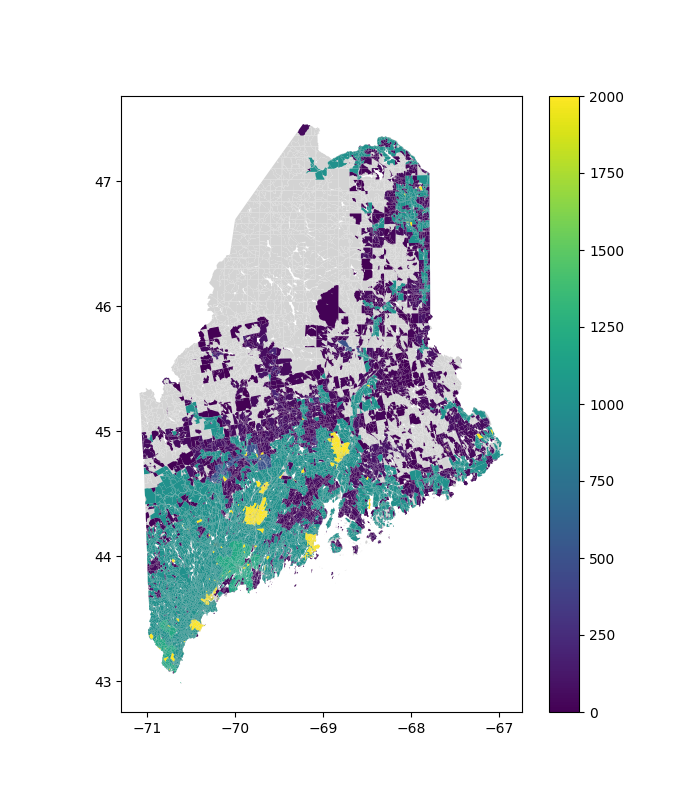
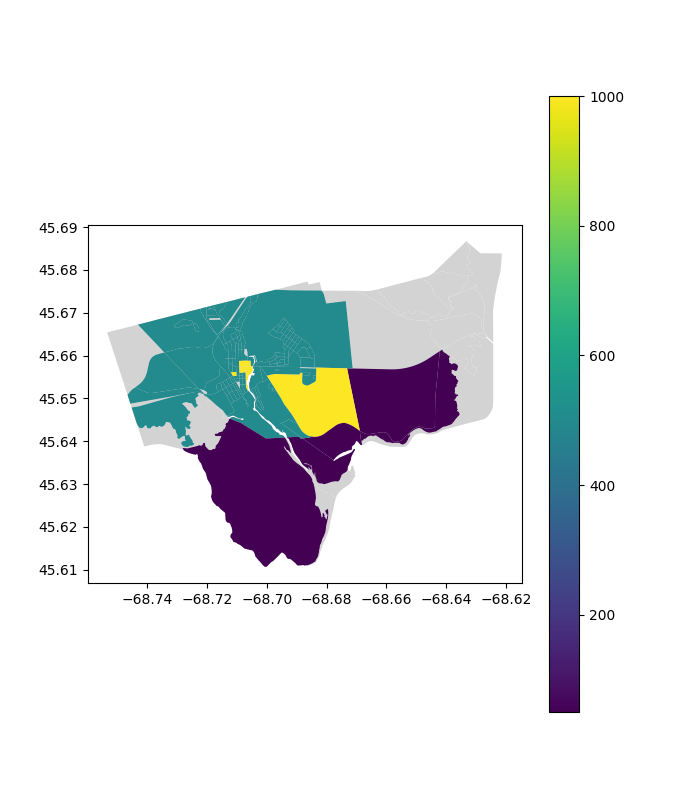
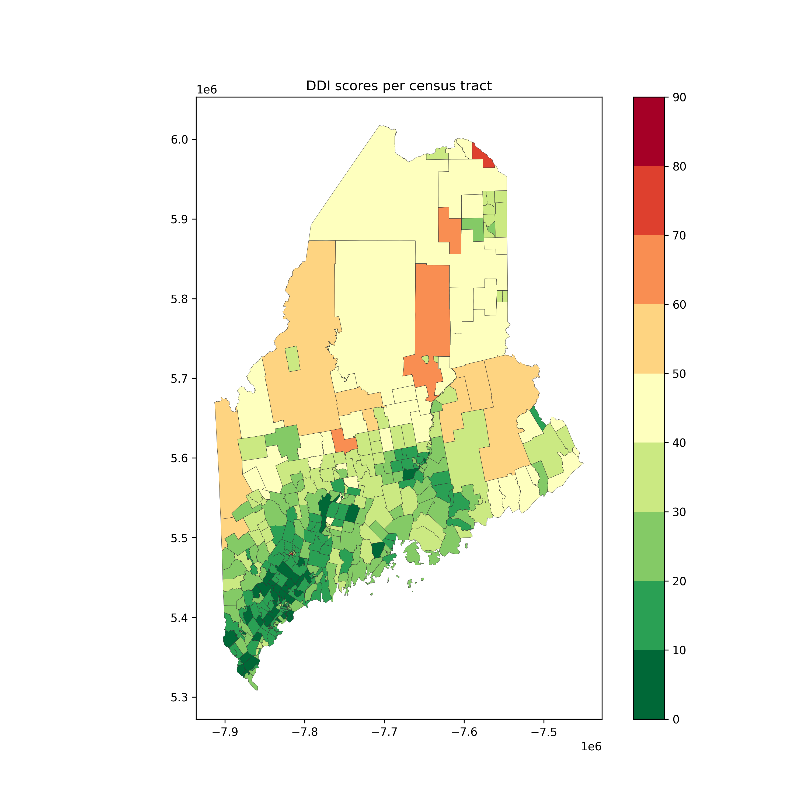
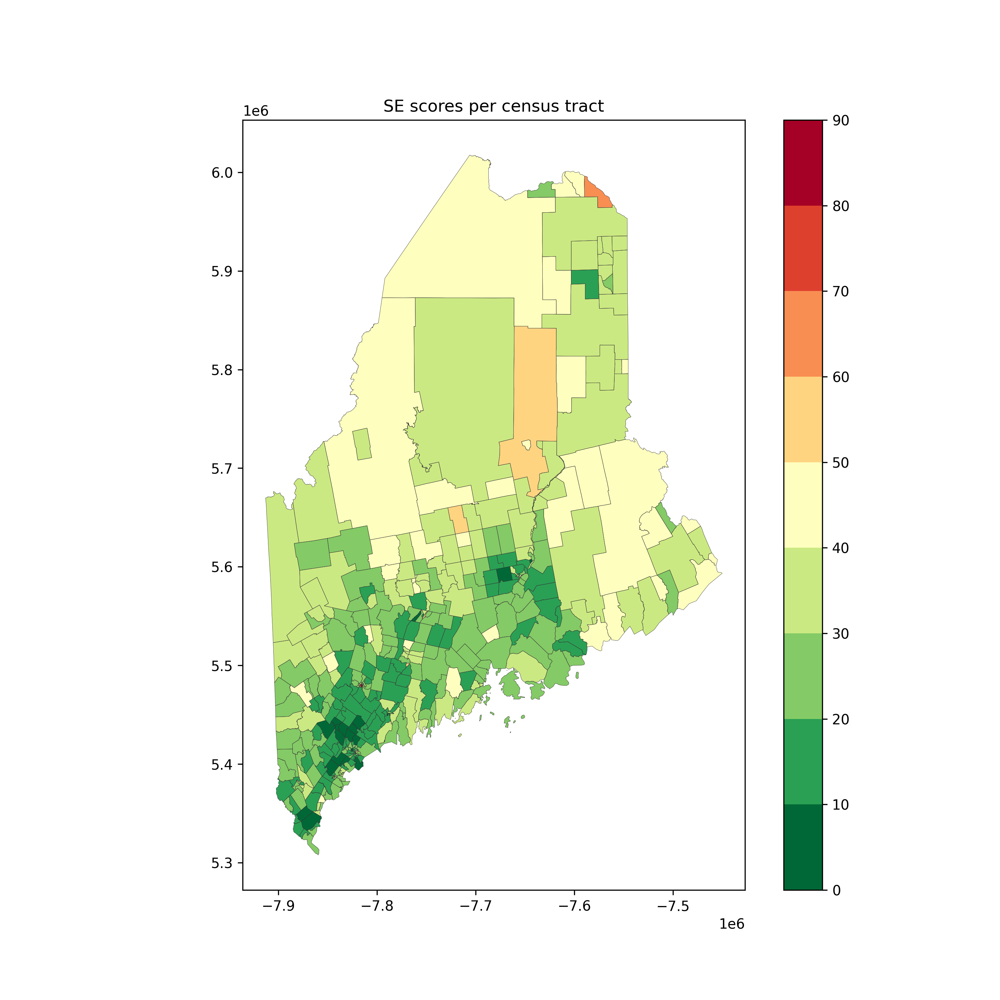
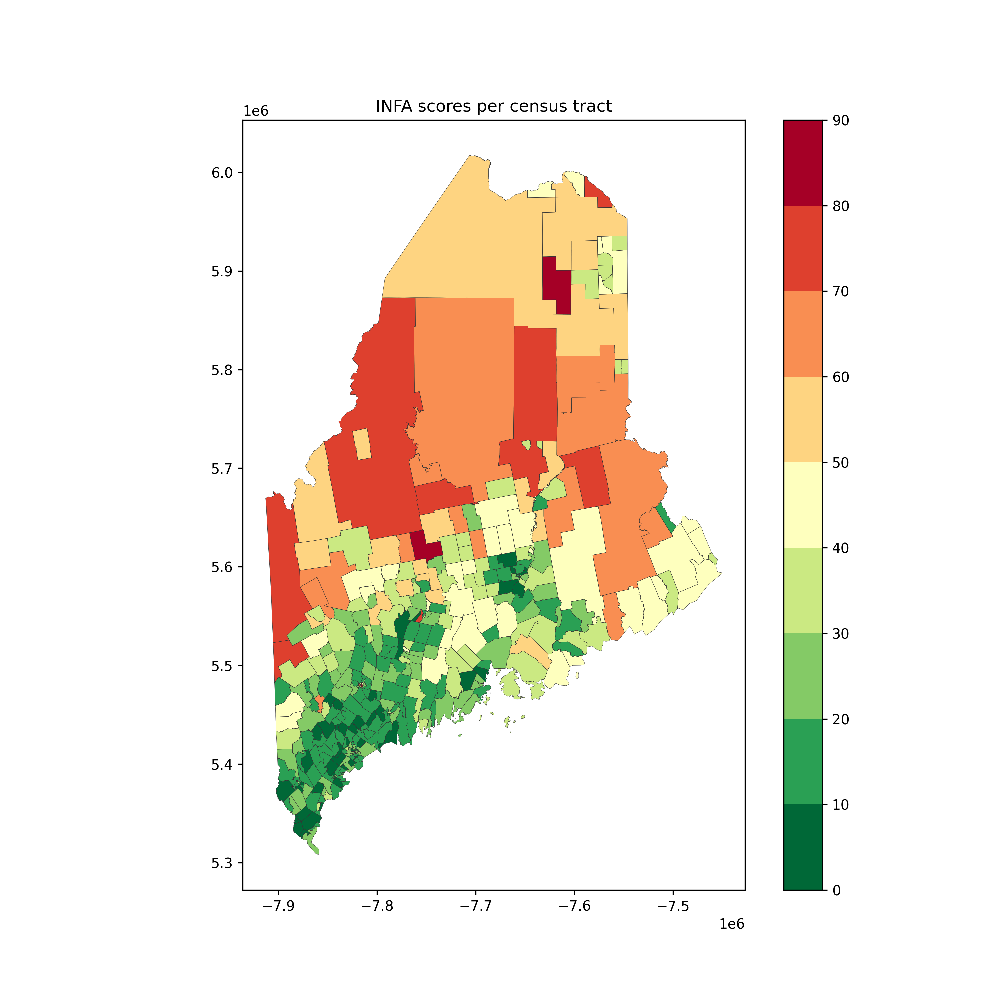

# broadband-4

## Step 1
Run the following command to download the State of Maine shape data and Census Digital Divide Index xlsx file from the web:
```
make data
```
The data comes from the following sources:

The FCC National Broadband Map [here](https://broadbandmap.fcc.gov/data-download/nationwide-data).  
Download the data for Cable, Copper, and Fiber to the Premises, then save those to your data folder.

The US Census Bureau shapefiles [here](https://www.census.gov/geographies/mapping-files/time-series/geo/tiger-line-file.html).
The specific file is found [here](https://www2.census.gov/geo/tiger/TIGER2022/TABBLOCK20/tl_2022_23_tabblock20.zip).

US Census Bureau county subdivision information [here](https://www2.census.gov/geo/maps/DC2020/DC20BLK/st23_me/cousub/cs2301945810_millinocket/DC20BLK_CS2301945810_BLK2MS.txt).

## Step 2
To clean the data and create a geojson file from the useable information in these files.
```
type: make json
```

## Step 3
Run the following command to a csv file with the maximum download speeds for Cable, Copper, and Fiber for each census block in Maine:

```
make speed
```

## Step 4
Calculate the average download speeed for Millinocket, which will be printed to the terminal.

```
make avg
```

The output you recieve should be "Millinocket average download speed: 516.423"

## Step 5
Merge the maximum download speeds information with the Census block data for Maine.

```
make json
```

## Step 6
Create a plot for maximum broadband speeds available throughout Maine

```
make state
```

## Step 7
Create a plot for maximum broadband speeds available in the individual Census blocks of Millinocket, Maine

```
make block
```



## Step 8

```
make DDI
```
DDI Data of different speeds will be saved as a CSV in data folder


## Step 9
Create plots and GeoJSON files for DDI, SE, and INFA scores by running the following command:
```
make maps
```

The plots should look like this:




