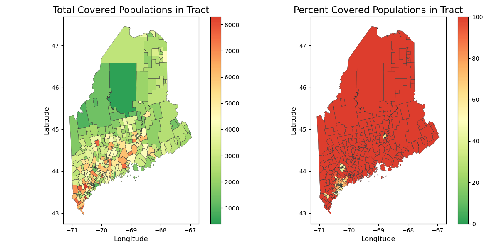
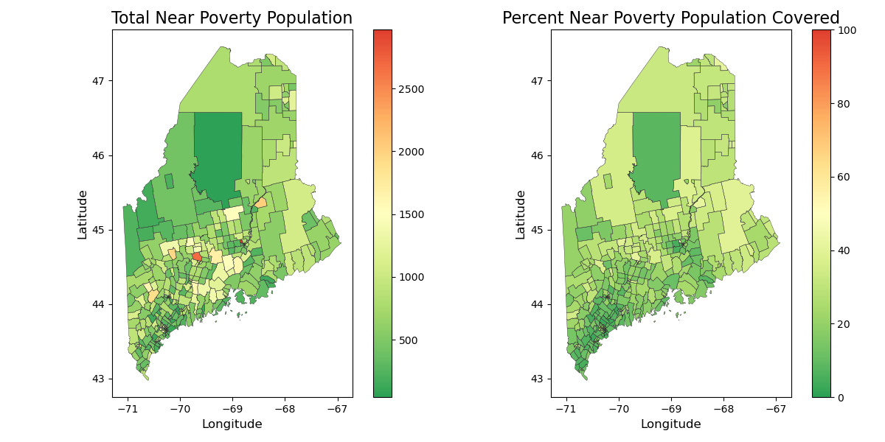
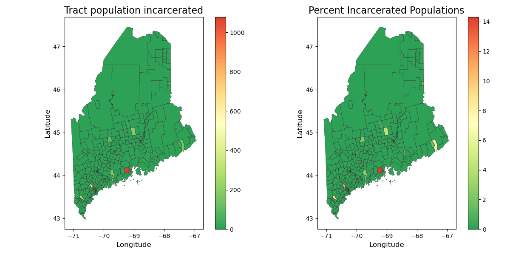
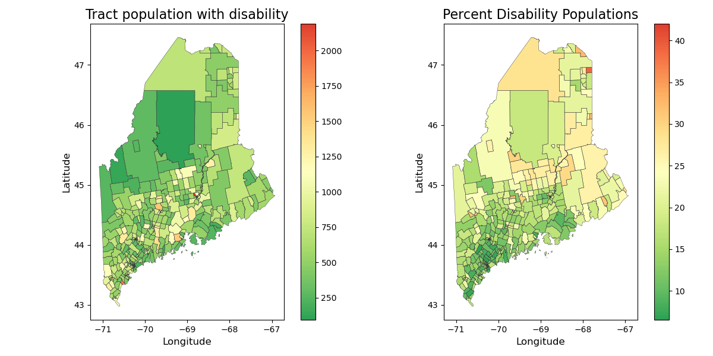
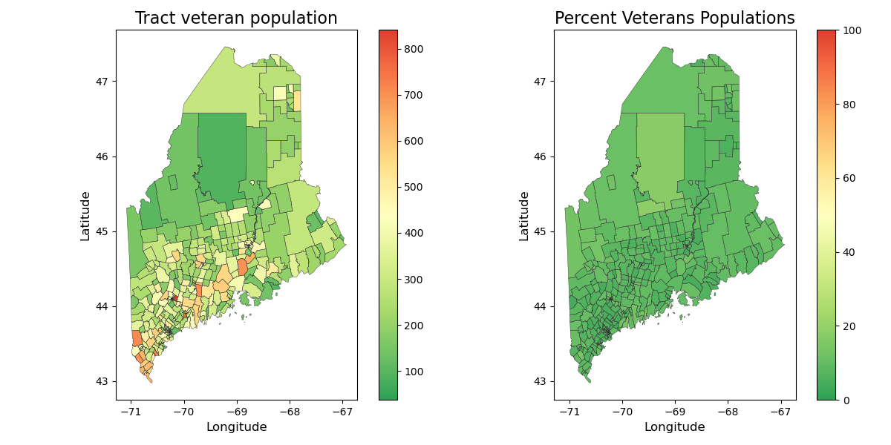
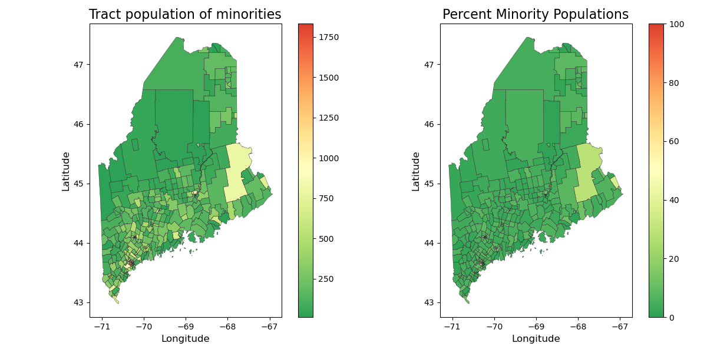

# Broadband-4
This repository takes data about Maine populations and plots them based on census tracts.

## Instructions for Use
### *Step 1: Generating the Data*
After cloning the repository, the following command will download and clean necessary data, placing them within the required directories
```
make data
```

### *Step 2: Reproducing the Map Figures*
The following command will plot the figures of covered populations of Maine based on numerous factors and save the PNGs in the `figs` directory. The covered population factors include *Total Covered Households, Low Income/Poverty, Ages 60+, Incarcerated, Disability, Veterans, Language Barrier, Those w/o Broadband or Computers, Minorities, Rural Living, and ESL*.
```
make plots
```
<p align="center">
    
</p><br>

<p align="center">
    
</p><br>

<p align="center">
    
</p><br>

<p align="center">
    
</p><br>

<p align="center">
    
</p><br>

<p align="center">
    
</p><br>

<p align="center">
    
</p><br>

<p align="center">
    
</p><br>

<p align="center">
    
</p><br>

<p align="center">
    
</p><br>

<p align="center">
    
</p><br>