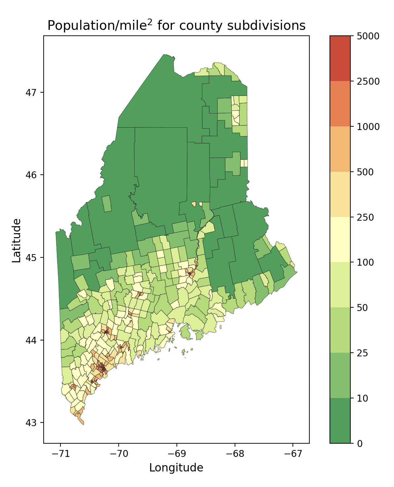

# Broadband-4
This repository takes data about Maine populations and plots them based on census tracts.

## Instructions for Use
### *Step 1: Generating the Data*
After cloning the repository, the following command will download and clean necessary data, placing them within the data and docs directories
```
make data
```

### *Step 2: Plotting Population Density*
The following command will plot a population density map of Maine based on the census data.
```
make density
```
<p align="center">
    
</p><br>

### *Step 3: Plotting Covered Population Charts*
Similar to step 2, the following command will plot multiple graphs on covered populations of Maine based on numerous factors *(Percent Covered Households, Percent Ages 60+, Percent Incarcerated, Percent Disability, Percent Veterans, Percent Language Barrier, Percent w/o Broadband or Computers, Percent Minorities, Percent Rural Living, and Percent ESL)*.
```
make plots
```