# Broadband-4
This repository takes data about Maine populations and plots them based on census tracts and counties.

## Instructions for Use
### *Step 1: Generating the Data*
After cloning the repository, the following command will download and clean necessary data, placing them within the required directories
```
make data
```

### *Step 2: Reproducing the Map Figures*
The following command will plot the figures of covered populations of Maine tracts/counties based on numerous factors and save the PNGs in the `figs` directory. The covered population factors include *Total Covered Households, Low Income/Poverty, Ages 60+, Incarcerated, Disability, Veterans, Language Barrier, Those w/o Broadband or Computers, Minorities, Rural Living, ESL, Low Literacy (county only), and Those w/o Fixed Broadband (county only)*.
```
make plots
```
### Tract Plots
<p align="center">
    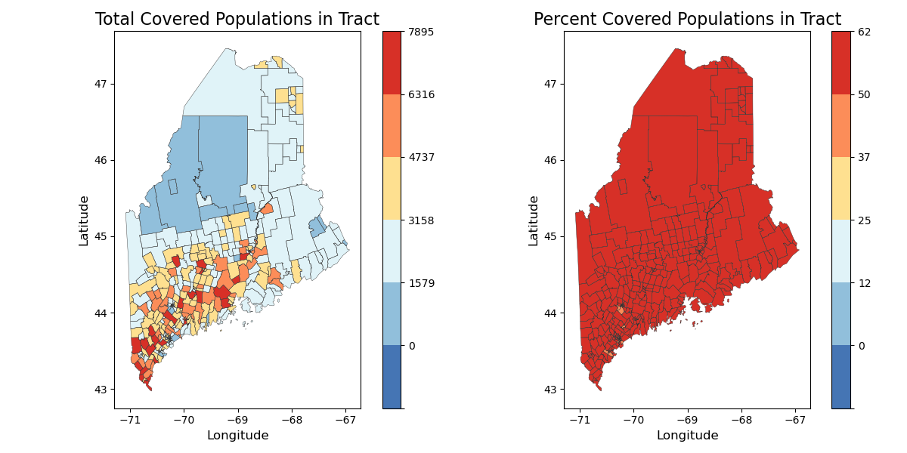
</p><br>

<p align="center">
    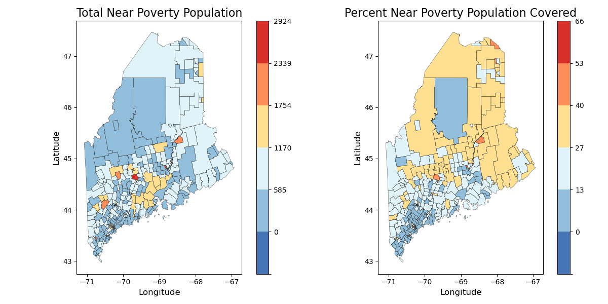
</p><br>

<p align="center">
    
</p><br>

<p align="center">
    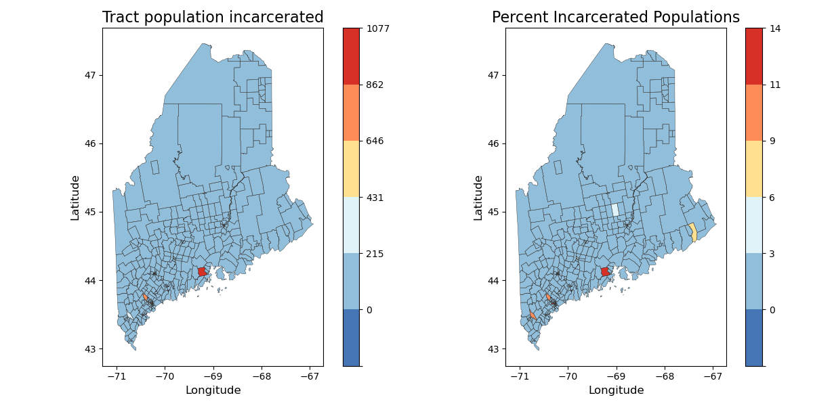
</p><br>

<p align="center">
    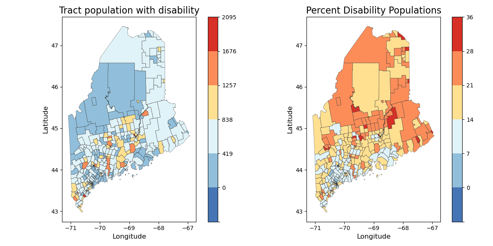
</p><br>

<p align="center">
    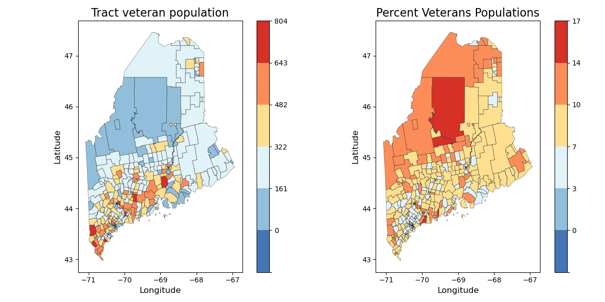
</p><br>

<p align="center">
    
</p><br>

<p align="center">
    
</p><br>

<p align="center">
    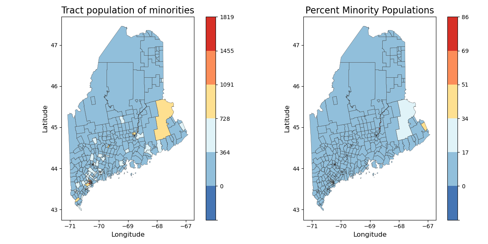
</p><br>

<p align="center">
    
</p><br>

<p align="center">
    
</p><br>

### County Plots
<p align="center">
    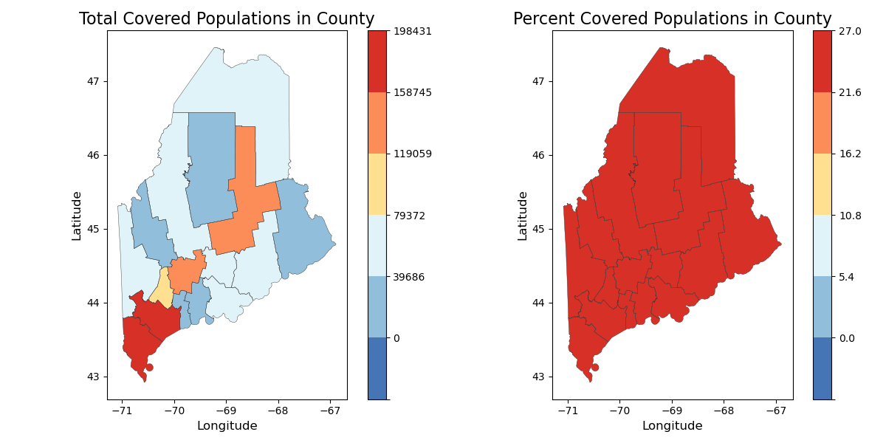
</p><br>

<p align="center">
    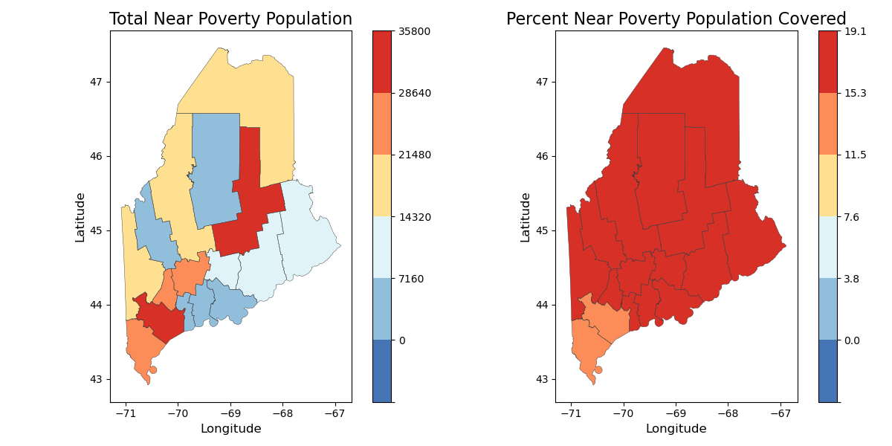
</p><br>

<p align="center">
    
</p><br>

<p align="center">
    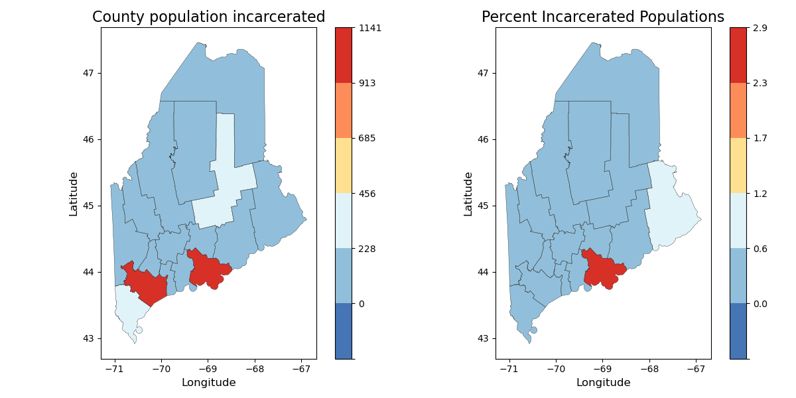
</p><br>

<p align="center">
    
</p><br>

<p align="center">
    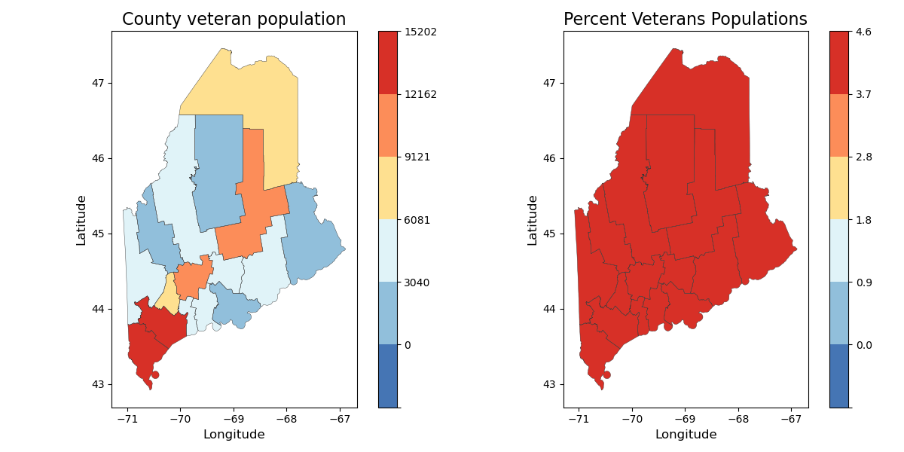
</p><br>

<p align="center">
    
</p><br>

<p align="center">
    
</p><br>

<p align="center">
    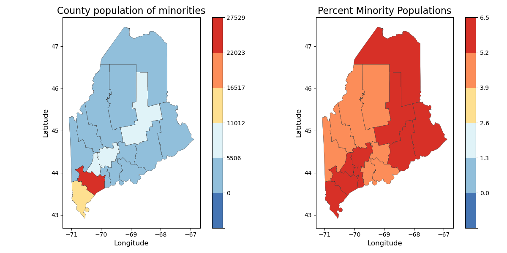
</p><br>

<p align="center">
    
</p><br>

<p align="center">
    
</p><br>

<p align="center">
    
</p><br>

### *Step 3: Reproducing the County Bar Graphs*
The following command will plot bar graphs that compare all 16 of Maine's counties based on numerous factors. These will then be saved in the `figs/bargraphs` directory. The comparison factors include *Percent Low Income/Poverty Population, Percent Ages 60+ Population, Percent Incarcerated Population, Percent Disability Population, Percent Veterans Population, Percent Language Barrier Population, Percent Minority Population, and Percent Rural Population*.
```
make bars
```
<p align="center">
    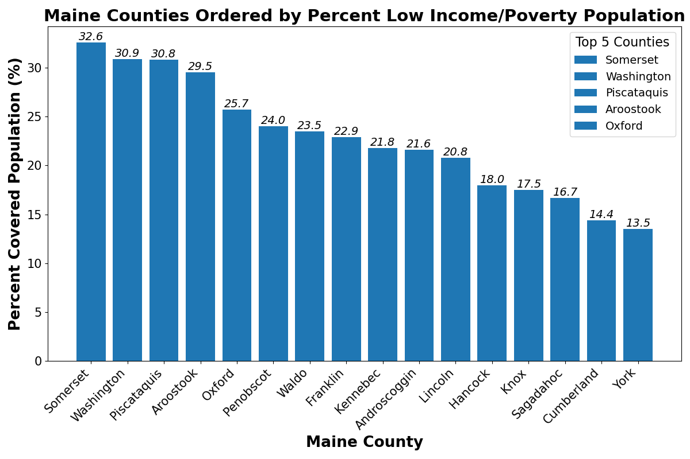
</p><br>
<p align="center">
    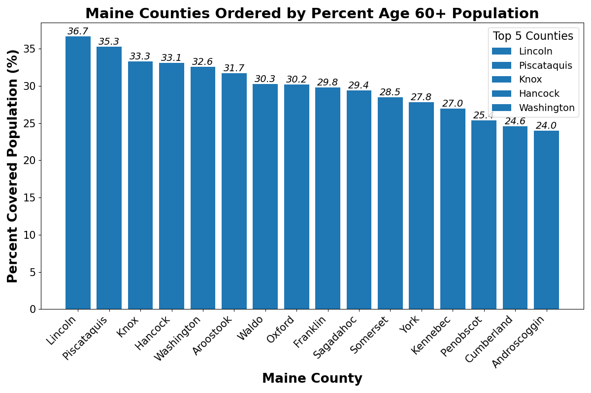
</p><br>
<p align="center">
    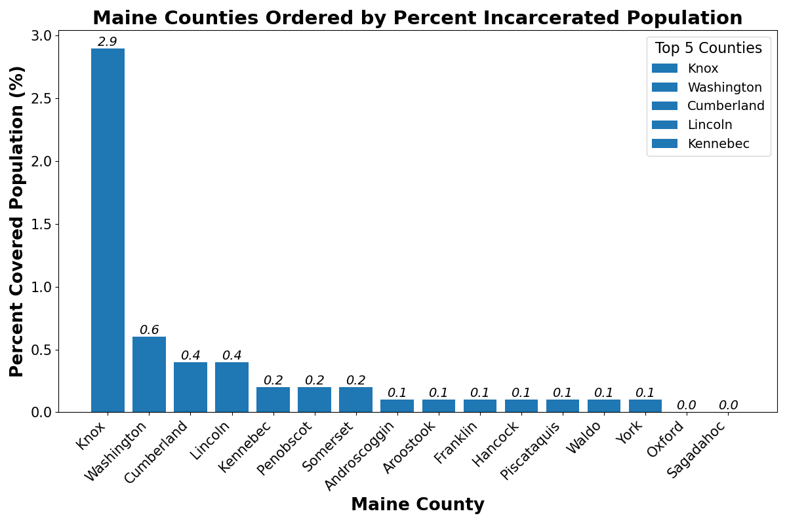
</p><br>
<p align="center">
    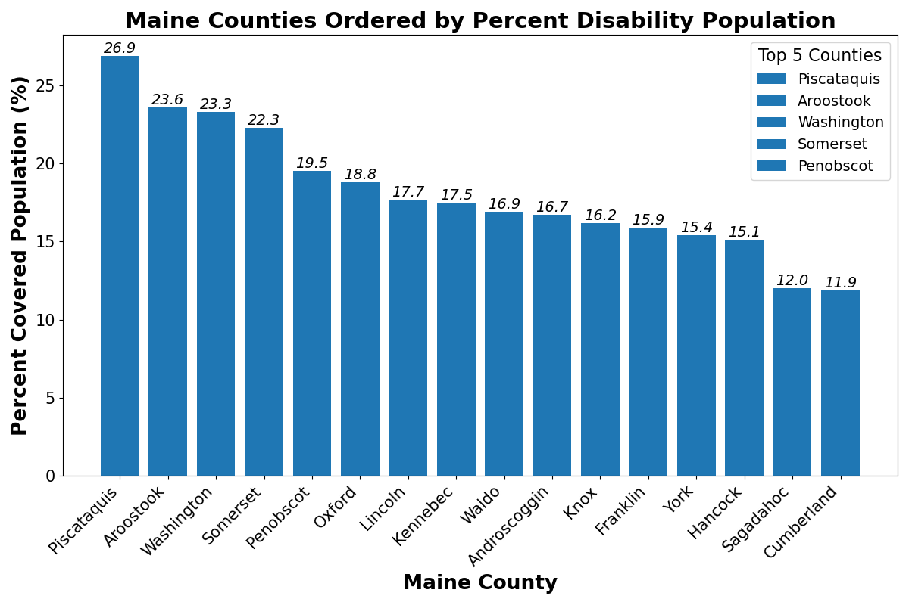
</p><br>
<p align="center">
    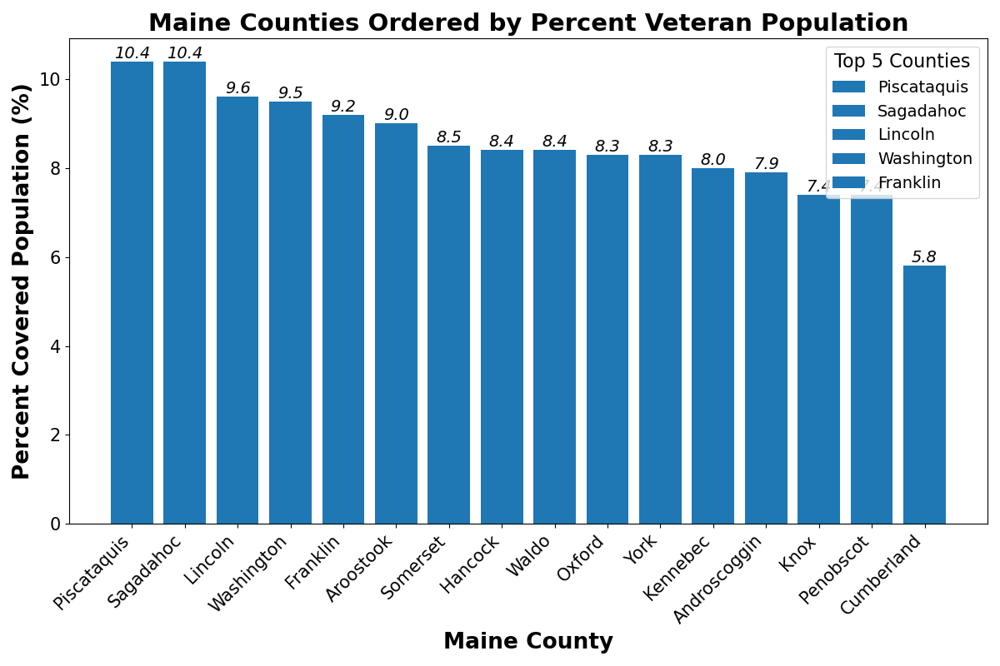
</p><br>
<p align="center">
    
</p><br>
<p align="center">
    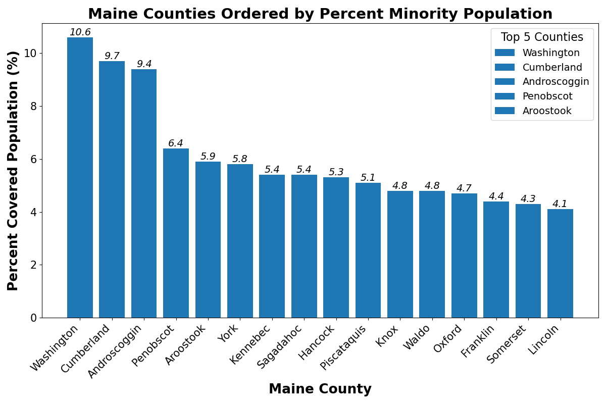
</p><br>
<p align="center">
    
</p><br>